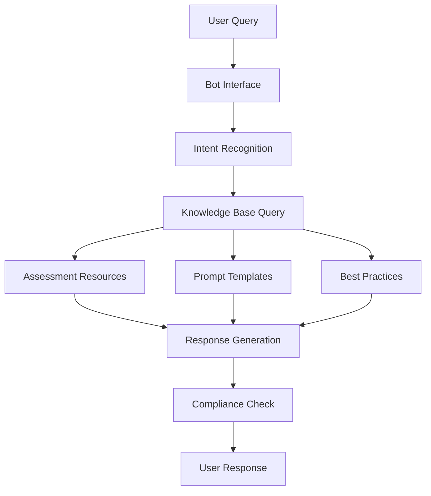

# Bot Implementation Guide for Educational Assessment Framework

## Overview
This guide outlines how to create an AI-powered bot trained on the educational assessment resources in this repository.

## Quick Start Options

### Option 1: No-Code Solution (Recommended for Pilot)
**Platform:** Microsoft Copilot Studio
- **Setup Time:** 1-2 days
- **Cost:** $30-150/month
- **Best For:** Quick deployment, testing concepts

```yaml
Implementation Steps:
1. Export all markdown files to structured Q&A pairs
2. Upload to Copilot Studio knowledge base
3. Configure conversation flows for:
   - Assessment type selection
   - UDL compliance checking
   - QM standards alignment
   - Inclusive design recommendations
4. Test with sample faculty queries
5. Deploy to Teams or web interface
```

### Option 2: Custom RAG Solution (Recommended for Production)
**Stack:** Python + LangChain + OpenAI/Claude API
- **Setup Time:** 2-4 weeks
- **Cost:** ~$500/month (API costs)
- **Best For:** Full control, custom features

```python
# Basic implementation structure
from langchain import OpenAI, VectorDBQA
from langchain.document_loaders import DirectoryLoader
from langchain.indexes import VectorstoreIndexCreator

# Load your educational resources
loader = DirectoryLoader(
    './Instructional Design Principles/',
    glob='**/*.md'
)

# Create vector database
index = VectorstoreIndexCreator().from_loaders([loader])

# Query the bot
def query_assessment_bot(question):
    return index.query(question)
```

### Option 3: Enterprise Solution
**Platform:** Azure AI + Bot Framework
- **Setup Time:** 2-3 months
- **Cost:** $50,000-100,000 total
- **Best For:** Institution-wide deployment

## Data Preparation

### 1. Structure Your Training Data

```json
{
  "assessment_types": {
    "formative": {
      "description": "Low-stakes learning checks",
      "examples": ["exit tickets", "quizzes", "discussions"],
      "best_practices": ["immediate feedback", "multiple attempts"]
    },
    "summative": {
      "description": "High-stakes evaluations",
      "examples": ["finals", "projects", "papers"],
      "best_practices": ["clear rubrics", "aligned objectives"]
    }
  },
  "frameworks": {
    "udl": {
      "principles": ["multiple means of representation", ...],
      "checklist": ["visual options", "audio options", ...]
    },
    "quality_matters": {
      "standards": ["measurable objectives", "aligned assessments", ...],
      "rubric": {...}
    }
  }
}
```

### 2. Create Training Datasets

```python
# Convert markdown to training data
import os
import json
from pathlib import Path

def prepare_training_data():
    training_data = []

    # Process each markdown file
    for md_file in Path('./Instructional Design Principles').rglob('*.md'):
        with open(md_file, 'r') as f:
            content = f.read()

        # Extract Q&A pairs, examples, and guidelines
        training_data.append({
            'source': str(md_file),
            'content': content,
            'category': determine_category(md_file),
            'metadata': extract_metadata(content)
        })

    return training_data
```

### 3. Implement FERPA Compliance

```python
# Ensure no student data in training
def sanitize_data(data):
    # Remove any PII patterns
    import re

    # Remove email addresses
    data = re.sub(r'\S+@\S+', '[EMAIL_REMOVED]', data)

    # Remove student IDs (various formats)
    data = re.sub(r'\b\d{6,9}\b', '[ID_REMOVED]', data)

    # Remove names (this is complex - use NER library)
    # ... additional sanitization ...

    return data
```

## Implementation Architecture

### Recommended Architecture



### Core Components

#### 1. Knowledge Base
```python
knowledge_base = {
    "assessment_guidance": "path/to/assessment-templates.md",
    "udl_principles": "path/to/udl-guide.md",
    "quality_matters": "path/to/qm-standards.md",
    "inclusive_design": "path/to/inclusive-teaching.md",
    "prompt_library": "path/to/prompt-library.md"
}
```

#### 2. Intent Handlers
```python
intents = {
    "create_assessment": handle_assessment_creation,
    "check_compliance": handle_compliance_check,
    "generate_rubric": handle_rubric_generation,
    "get_examples": handle_example_request,
    "improve_accessibility": handle_accessibility
}
```

#### 3. Response Templates
```python
templates = {
    "assessment_recommendation": """
    Based on your requirements for {course_level} {subject_area}:

    Assessment Type: {recommended_type}

    UDL Considerations:
    - {udl_recommendations}

    Quality Matters Alignment:
    - {qm_alignment}

    Inclusive Design Elements:
    - {inclusive_features}

    Suggested Prompt:
    {ai_prompt}
    """,

    "compliance_report": """
    Compliance Analysis for your {assessment_type}:

    ✓ UDL Compliance: {udl_score}%
    ✓ QM Alignment: {qm_score}%
    ✓ Accessibility: {accessibility_score}%
    ✓ Inclusivity: {inclusivity_score}%

    Recommendations:
    {improvement_suggestions}
    """
}
```

## Deployment Options

### 1. Web Interface
```html
<!-- Simple chat interface -->
<div id="assessment-bot">
    <div id="chat-history"></div>
    <input type="text" id="user-input"
           placeholder="Ask about assessment design...">
    <button onclick="sendQuery()">Send</button>
</div>

<script>
async function sendQuery() {
    const query = document.getElementById('user-input').value;
    const response = await fetch('/api/bot', {
        method: 'POST',
        body: JSON.stringify({ query }),
        headers: { 'Content-Type': 'application/json' }
    });
    const data = await response.json();
    displayResponse(data.response);
}
</script>
```

### 2. Microsoft Teams Integration
```javascript
// Teams bot implementation
const { TeamsActivityHandler } = require('botbuilder');

class AssessmentBot extends TeamsActivityHandler {
    constructor() {
        super();

        this.onMessage(async (context, next) => {
            const query = context.activity.text;
            const response = await this.processAssessmentQuery(query);
            await context.sendActivity(response);
            await next();
        });
    }

    async processAssessmentQuery(query) {
        // Query your knowledge base
        // Return formatted response
    }
}
```

### 3. LMS Integration (Canvas Example)
```python
# Canvas LTI integration
from flask import Flask, request
from canvasapi import Canvas

app = Flask(__name__)

@app.route('/lti/assessment-bot', methods=['POST'])
def assessment_bot_lti():
    # Validate LTI request
    if not validate_lti_request(request):
        return "Unauthorized", 401

    # Get user context
    course_id = request.form.get('custom_canvas_course_id')
    user_id = request.form.get('custom_canvas_user_id')

    # Render bot interface with context
    return render_template('bot.html',
                         course_id=course_id,
                         user_id=user_id)
```

## Testing Strategy

### 1. Test Queries
```python
test_queries = [
    "How do I create an inclusive assessment for MBA students?",
    "What are UDL principles for online quizzes?",
    "Generate a rubric for case study analysis",
    "Check my assessment for QM compliance",
    "Suggest alternatives to traditional exams",
    "How can AI enhance formative assessment?",
    "What are best practices for peer assessment?"
]
```

### 2. Validation Metrics
- Response accuracy (expert review)
- Response time (<2 seconds)
- Compliance accuracy (FERPA, accessibility)
- User satisfaction (survey)
- Framework alignment (UDL, QM checklist)

## Security and Compliance

### FERPA Compliance Checklist
- [ ] No student data in training sets
- [ ] Encrypted data transmission
- [ ] Access logging and audit trails
- [ ] Regular security assessments
- [ ] Data retention policies
- [ ] User authentication required

### Data Privacy
```python
# Implement data privacy controls
class PrivacyCompliantBot:
    def __init__(self):
        self.audit_log = []

    def process_query(self, query, user_id):
        # Log query without PII
        self.log_query(self.anonymize(query), user_id)

        # Process and respond
        response = self.generate_response(query)

        # Don't store responses with PII
        return self.sanitize_response(response)
```

## Monitoring and Analytics

### Key Metrics to Track
```python
metrics = {
    "usage": {
        "daily_active_users": 0,
        "queries_per_day": 0,
        "average_session_length": 0
    },
    "performance": {
        "response_time_ms": [],
        "error_rate": 0,
        "success_rate": 0
    },
    "content": {
        "most_requested_topics": {},
        "unanswered_queries": [],
        "feedback_scores": []
    }
}
```

### Dashboard Implementation
```python
# Simple analytics dashboard
from flask import Flask, jsonify
import pandas as pd

@app.route('/api/analytics')
def get_analytics():
    # Aggregate metrics
    data = {
        'total_queries': count_queries(),
        'top_topics': get_top_topics(),
        'satisfaction': calculate_satisfaction(),
        'usage_trend': get_usage_trend()
    }
    return jsonify(data)
```

## Cost Optimization

### API Cost Management
```python
# Implement caching to reduce API calls
from functools import lru_cache
import hashlib

@lru_cache(maxsize=1000)
def cached_bot_response(query_hash):
    # Only call API for new queries
    return generate_response(query_hash)

def process_query(query):
    # Hash query for caching
    query_hash = hashlib.md5(query.encode()).hexdigest()

    # Check cache first
    return cached_bot_response(query_hash)
```

### Resource Scaling
```yaml
# Kubernetes deployment for scaling
apiVersion: apps/v1
kind: Deployment
metadata:
  name: assessment-bot
spec:
  replicas: 2
  selector:
    matchLabels:
      app: assessment-bot
  template:
    spec:
      containers:
      - name: bot
        image: assessment-bot:latest
        resources:
          requests:
            memory: "256Mi"
            cpu: "250m"
          limits:
            memory: "512Mi"
            cpu: "500m"
```

## Maintenance and Updates

### Regular Update Schedule
- **Weekly:** Review unanswered queries
- **Monthly:** Update knowledge base with new resources
- **Quarterly:** Retrain models with new data
- **Annually:** Major feature updates and framework updates

### Version Control
```bash
# Track bot configurations and knowledge base
git init assessment-bot
git add knowledge_base/
git add configs/
git add prompts/
git commit -m "Initial bot configuration"

# Tag releases
git tag -a v1.0.0 -m "Initial release"
```

## Support and Documentation

### User Documentation
- Quick start guide for faculty
- Common query examples
- Troubleshooting guide
- Video tutorials

### Developer Documentation
- API reference
- Integration guides
- Contribution guidelines
- Architecture diagrams

## Contact and Support

**Project Lead:** EdTech Lab Team
**Email:** jkruck@ivey.ca
**Repository:** [GitHub Link]
**Documentation:** [Wiki Link]

---

*This implementation guide is part of the Ivey Business School EdTech Lab AI Assessment Framework*